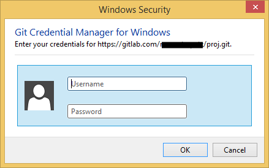
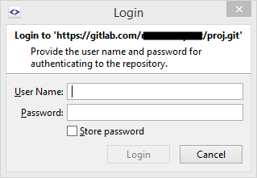

# Authentication problems (push/pull fail)

This is a collection of common problems and resolutions related to
authentication.

# Preparation/general

`log.txt` denotes SmartGit's log file which can be found in the
[Settings Directory](https://www.syntevo.com/doc/display/SG170/Installation+and+Files).

While resolving authentication-related problems, it's recommended to
disable **Detect remote changes** option in the **Preferences**,
section **Background Commands** to prevent background operations
spoiling the log file with too many problems.

An *independently opened* terminal/shell refers to a terminal/shell
which has not been opened through SmartGit:

-   On Windows, you will usually just invoke `cmd.exe` from
    the **Start**-button.
-   On Linux/OSX, open a *terminal*

# Error: Authentication failed for '...'

#### Step "Check Command"

Check `log.txt` for the exact command which fails and try to invoke the
command from an *independently opened* terminal/shell.

-   If the command works there, continue with step "Check Git-Shell".
-   Otherwise, check whether the access URL is actually correct and your
    credentials are correct.

#### Step "Check Git-Shell"

Open a Git shell from within SmartGit: right-click the offending
repository in the **Branches** view and invoke **Open Git-Shell** and
try to invoke the command from this shell.

-   If the command works there
    -   if you are on Windows, continue with step "Check Windows
        AutoRun"
    -   otherwise, continue with step "Contact Support".
-   If the command does not work there
    -   if you are on Windows, continue with step "Check Git Credential
        Manager".
    -   continue with step "Check Environment Differences".

#### Step "Check Windows AutoRun"

Command Processor AutoRun scripts may interfere with SmartGit's
authentication hook. Open the Windows registry and check whether for key
`HKEY_CURRENT_USER\Software\Microsoft\Command Processor` the
value `AutoRun` is configured.

-   If not configured, continue with step "Contact Support"
-   Otherwise, temporarily rename the `AutoRun` script to `AutoRun~` and
    see whether authentication works now.
    -   If it works now, consider to permanently disable the AutoRun
        script or [enable Git's credential manager](http://stackoverflow.com/a/15382950).
    -   If it still does not work, leave `AutoRun~` renamed and restart
        with step "[Check Command](#step-check-command)".

#### Step "Check Credential Manager"

If you are on Windows and SmartGit as well as command line Git client
simply fails without asking you for a password,

-   open the Windows "Credential Manager", check for possible Git
    credentials there and get rid of them, then try again to pull/push
    (from command line)
-   If this still does not help, this may be due to a problem in the
    Git-Windows credential handling. You may check by temporarily
    disabling the system credential helper using following command:  
      
    `git config --global --unset credential.helper`and invoke the
    pull/push again.``
    -   if this solves the problem, consider to report this problem to
        the Git mailing list:
        <https://git.wiki.kernel.org/index.php/GitCommunity>
    -   if this does not solve the problem, continue with step "Contact
        Support".

#### Step "Check Environment Differences"

Compare environment variables of the *independently opened*
terminal/shell and the *Git-Shell* for possible differences

-   If this gives you a clue on what the problem is, please drop us some
    lines at <smartgit@syntevo.com>
-   If you can't figure out the reason, continue with step "Contact
    Support".

#### Step "Contact Support"

Send us a detailed description of the problem, including:

-   the problem resolutions you have already tried,
-   output of environment variables you have compared,
-   the `log.txt` file

to <smartgit@syntevo.com>

# Error: Could not read from remote repository, GitLab: the project you were looking for could not be found

#### Step "Check GitLab Configuration"

Go to your GitLab server configuration page (or ask your administrator
to do so) and make sure that you have been granted all necessary access
rights. You may start off with granting all possible rights and
step-by-step reduce rights as long as you can still **pull**
and **push** to the offending repository.

-   If you can't get the access problem resolved, continue with step
    "[Contact Support](#step-contact-support)".

# Error (Bitbucket): Server returned HTTP response code: 400 for URL: <https://bitbucket.org/site/oauth2/access_token>

#### Step "Check Bitbucket Configuration"

On the setup of the Bitbucket hosting provider, SmartGit has retrieved a
"refresh" token which it is using subsequently to request short-lived
"access" tokens. Under certain circumstances, this refresh token may
become invalid. In this case, it will be necessary to recreate the
hosting provider: go to the **Preferences**, section **Hosting
Provider**, get rid of the Bitbucket hosting provider an re-**Add** the
hosting provider.

-   If this still does not resolve your problem, continue with step
    "[Contact Support](#step-contact-support)".

# SmartGit only stores one pair of credentials for a single domain (e.g. github.com)

#### Step "Check Credentials Helper"

If:

-   SmartGit fails to access a repository on a domain for which you have
    another repository working;
-   and you actually have to use different credentials for both
    repositories

this might be caused by having configured a Git `credential.helper`
(probably in your global `.gitconfig` or in the
system-wide `.gitconfig`). To resolve, you may set `useHttpPath` option,
see <https://git-scm.com/docs/gitcredentials>.

# Details on the interaction between SmartGit and Git's credential manager on Windows

If you have `credential.helper=manager` configured on Windows, Git will
first invoke special code which tries to retrieve the password from the
Windows Credential Manager.

1.  If the correct credentials are stored there, it's fine.
2.  If not, Windows will ask for credentials:  
    
3.  If you will enter the correct credentials there, it's fine.
4.  If you will enter wrong credentials there, the dialog will show up
    again (back to step 2, this happens a couple of times).  
      
    **Up to this point SmartGit was not involved in the credentials
    prompt at all.**  
      
5.  If you cancel the dialog, Git will invoke the `GIT_ASKPASS`
    environment variable callback which is set by SmartGit.
6.  If the correct credentials are stored in SmartGit, they will be
    returned.
7.  Otherwise, SmartGit will show its own credentials dialog:  
    
8.  If you will enter the correct credentials there, it's fine.
9.  If you will enter wrong credentials there, the dialog will show up
    again (back to step 7, this happens a couple of times).  
      
    **In either case, the credentials returned by SmartGit will be
    stored in the Windows Credentials Manager, too. Hence, subsequent
    requests for these credentials will be served directly from the
    Credentials Manager (step 1).**

 

# Debug logging: enable injector logging

To intercept Git credential prompts, SmartGit is "injecting" callback
scripts. To enable debug logging for these scripts, perform following
steps:

-   Add following line to `smartgit.properties`, which is located in the
    settings directory:  
    `smartgit.injectorLogging=true`
-   Restart SmartGit
-   Retry the failing operation
-   Once the problem has occurred again, shutdown SmartGit
-   Backup all `smartgit-http-*` and `smartgit-ssh-*` files from the
    settings directory
-   Upon request from us, compress these files, include `log.txt*`-files
    and send them <smartgit@syntevo.com>

