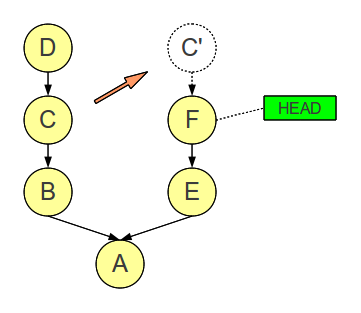

# How to perform a cherry-pick

A cherry-pick allows you to take the changes from a single commit of
another branch and apply these changes on top of the current branch.
This operation is illustrated below:

Here, we have two branches and our HEAD is at commit F. Now we want to
take the changes made in commit C and apply them on top of F.

In SmartGit, there are two ways to perform a cherry-pick, either from
the main window or from the log window. In both cases, you have to first
check out the branch containing commit F.

-   Main window: From the main menu, select **Branch\|Merge** . On the
    Merge dialog that shows up, select the commit to cherry-pick from,
    then select the option **Only the selected commits (cherry-pick)**.
    Finally, click on the **Merge** button to perform the cherry-pick
    operation.
-   Log window: On the *Commits* view, right-click on the commit to
    cherry-pick from. From the context menu, select **Cherry-Pick**. On
    the following dialog, choose whether you just want to apply the
    changes from the selected commit to the working tree, or whether you
    want to apply the changes to the working tree and commit these
    changes as well.

