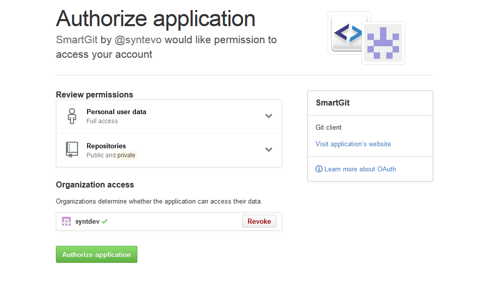
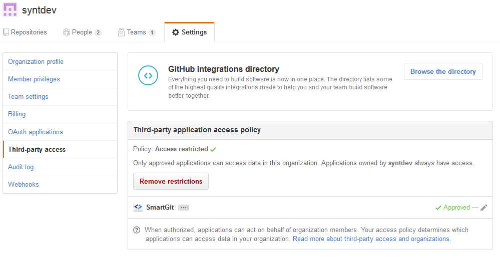

# GitHub integration

SmartGit integrates GitHub workflows in various places, provided that
the connection to *github.com* or a custom *GitHub Enterprise instance*
has been configured in the Preferences.

### Setup

To set up the GitHub integration, go to **Preferences**, section
**Hosting Providers** and use **Add** there. In the **Add Hosting
Provider** dialog, have **GitHub** selected and invoke **Generate API
token**. This should open up your default web browser where you will
have to confirm by **Authorize Application**. Be sure to also **Grant
Access** to all of your organizations, otherwise the corresponding
organization repositories won't show up/can't be accessed.



Once you have confirmed this page, you will be redirected to
*syntevo.com*, where the generated access code will be displayed.
Copy&paste this code into SmartGit's **Generate API Token** dialog and
invoke **Authenticate**. The code will be used to create an *application
access token* which will be used to populate the **Token** field.
Finally, confirm the **Add Hosting Provider** dialog using **Add**.


Once you have authorized SmartGit, it will show up in your GitHub
**Settings**, section **Authorized Applications**. If you need to rerun
through the Authorization process outlined above, you have to **Revoke**
access there first and start over.


## Clone

When
[cloning](Repository-Related.md#cloning-a-repository) a
repository, you can select your repository from a list, instead of
entering the URL. SmartGit will display your own (*user*) repositories,
as well as repositories of your *organization* (*org*).

## Main Window

The main window contains a light-weight GitHub integration which gives
you an overview of incoming Pull Requests in the **Branches** view.


Pull request operations are only available in the **Log** (see below).


## Log

In the *Log* window of your repository, you can interact with GitHub in
following ways.

### Pull Requests

When initially loading the Log, SmartGit will also refresh information
on related *Pull Requests* from the GitHub server:

-   **Incoming** pull requests are those which other users are
    requesting to pull from their repositories. They are displayed in a
    separate category called **Pull Requests** in the **Branches** view.
-   **Outgoing** pull requests are those which you have sent to other
    users/repositories, requesting them to pull your changes. They are
    display directly below the local (or if it does not exist), the
    remote branch in the **Branches** view.

*Incoming* pull requests, in first place, are just known on the server.
To get the commits, which such a pull request includes, locally, use
invoke **Fetch Pull Request** from the context menu of the pull request.
This will fetch all commits from the foreign repository to a special
branch in your local repository and will create an additional *merge*
node between the *base* commit from which the pull request has been
forked and the latest (foreign) pull request commit. When selecting this
*merge* node in the **Graph**, you can see the entire changes which a
multi-commit pull request includes and you can
[comment](#comments) on these changes, if
necessary. After commenting changes, it's probably a good idea to
**Reject** the pull request to signal the initiator of the pull request,
that modifications are required before you are willing to pull his
changes. If you are fine with a pull request, you may **Merge** it. This
will request the GitHub server to merge the pull request and then
SmartGit will pull the corresponding branch, so you will have the merged
changes locally available.

*Outgoing* pull requests can be **Fetch**ed as well, however this is
usually not necessary, as the pull request belongs to you and it
contains your own commits. If you decide that you want to take a pull
request back, use **Retract**.

For a pull request which had been fetched once, there was a special
*ref* created which will make it show up in the **Pull Requests**
category, even if it is not present on the server anymore. In this case,
you may use **Drop Local Data** on such a pull request to get rid of the
corresponding ref, the local merge commit, all other commits of the pull
request and the entry in **Pull Requests** as well. It's safe to use
**Drop Local Data**, as it will only affect the local repository and you
can re-fetch a pull request anytime you like using **Fetch** again.

You can invoke **Review\|Sync** to manually update the displayed
information. Usually you will want to do that, if you know that
server-side information has changed since the Log has been opened.

To create a pull request, use **Create Pull Request** from the context
menu of the **Branches** view.

### Comments

GitHub allows to comment on a commit itself or individual line changes
(*diffs*). Comments can be applied to a commit or to a Pull Request.
Comments will be refreshed together with pull requests after opening a
Log or when manually invoking **Review\|Sync**.

Commit comments will show up in the **Graph** view. Comments on
individual lines will show up in the **Changes** view and the affected
files will be highlighted in the **Files** and **Graph** view, too. This
works the same way for line-comments of Pull Requests, provided that the
pull request has been **Fetch**ed and the local pull request *merge*
commit has been selected.

Comments can be created, modified and removed using the corresponding
actions from the **Comments** menu or context menu actions in the
**Graph** and **Changes** view. If a pull request *merge* commit is
selected, only line-comments of the pull request can be manipulated.

Some behavior of the GitHub integration can be customized by [system properties](System-Properties.md#SystemProperties-properties.github)
.

## Possible Problems & Solutions

### Authenticating with two or more accounts

If you want to authenticate to your GitHub repositories, using two or
more accounts, open **Preferences**, section **Hosting Providers**, open
the GitHub hosting provider there and deselect **Use OAuth token for
repository authentication**. When pulling/pushing a GitHub repository
for the next time, SmartGit will ask you for **Username** and
**Password**. For the **Username**, just enter the appropriate GitHub
account name, for the **Password** it's recommended to generate a new
*Personal Access Token* in your GitHub account settings.

Depending on your Git configuration, Git might request credentials only
*per-domain* instead of *per-repository*. If so, try to reconfigure:


``` java
git config --global credential.useHttpPath true
```


Or even more selectively:


``` java
git config --global credential.github.com.useHttpPath true
```


### Private repositories do not show up

If you are authenticating using *OAuth* and you can't see private
repositories of your GitHub *organization* or pushing to your
organization's repositories fails with HTTP error code *403*, make sure
that your organization allows **Third-party access** and SmartGit
is **Approved**. Your organization settings might look like this:




If your GitHub hosting provider is already set up in the Preferences and
you need to rerun through the *OAuth* setup, then:

1.  Get rid of all GitHub-related credentials from **Preferences**,
    section **Authentication**
2.  Get rid of the GitHub hosting provider from **Preferences**, section
    **Hosting Providers**
3.  Rerun through the *OAuth* setup


### Git-Flow Pull Requests will be closed on Finish Feature

When using [Git-Flow](Git-Flow.md) or [Git-Flow Light](Git-Flow-Light.md) in
combination with pull requests, pull requests may be marked
as **Closed** instead of **Merged** after invoking **Finish
Feature**. This happens when you have **Delete Feature Branch** selected
for the **Finish Feature** dialog: with this option selected, the local
and remote feature branch will be deleted immediately, however the
resulting merge/rebase has not yet been pushed. If a branch will be
deleted *before* it has been merged, GitHub will mark the pull request
as **Closed**. If it's only deleted *after* the branch has been merged,
it will be marked as **Merged**. If you don't want your pull requests to
become **Closed**, unselect **Delete Feature Branch**, push the
resulting merge/rebase first and only then **Delete** the feature branch
from GitHub (e.g. from the **Branches** view).

 

 

 

 


