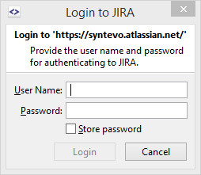

# JIRA

The JIRA integration allows to select a commit message (including JIRA
key) directly from (open) JIRA issues and to optionally mark issues as
resolved on **Push**.

## Prerequisites

The JIRA integration is only available for **commercial** licenses and
will only be present, if the [Bugtraq configuration](Bugtraq-links-to-issue-trackers-.md) has been set up
properly for your JIRA server.

When connecting to a cloud-based JIRA instance (\*.atlassian.net), you
have to login with your **username**, not your email address. You can
find your username in your **Profile** (top-right corner).

## Authentication with API

Depending on the JIRA version and/or server vs. cloud instance, it may
be fine to authenticate to JIRA using your username/password or it may
be necessary to create an API token.

To create an API token, open your JIRA account and select **Security**
settings there.

For the cloud instance, you can find security settings at:
<https://id.atlassian.com/manage-profile/security>

In the **API token** section, select **Create and manage API tokens**,
then select **Create API token**, label it e.g. "SmartGit" and finally
confirm with **Create**.

In the next dialog, invoke **Copy to clipboard**. Finally, the token
should show up in the list.

You should now be able to authenticate to JIRA from within SmartGit by
using your email address as **User Name** and the token as **Password**.

## Commit Message Selection

The commit message selection is available in the Commit and Edit Last
Commit Message commands as well in some interactive rebase commands of
the **Journal** view.

## Resolving on Push

For all **Push** operations (except of **Push To**), SmartGit checks the
pushed commits for *affected* JIRA issues and offers to mark them as
resolved in one or more JIRA versions. A JIRA issue is considered as
*affected*, if

1.  It's mentioned in at least one commit message of the *local* branch
    commits which are pushed; and

2.  It's not mentioned in any commit message of the *remote* branch
    commits which are going to be replaced; and

3.  when using Git-Flow, you are not pushing into a *feature* branch or
    a *hotfix* branch (SmartGit will ask you whether to resolve such
    commits when **Finishing** the feature or hotfix, i.e. integrating
    the commits into `develop` or `master`).

4.  The issue is actually *resolvable* (or more precisely: there is at
    least one *Transition* available which puts the issue into a
    *resolved* state. Note that, this is usually not the case for all
    issues, especially not for issues which are already resolved/closed.

  

Example

In JIRA's "classic workflow", an issue which is *in progress* can be
*resolved* or *closed*. Hence, for such issues which are mentioned in a
commit message, SmartGit will offer both resolutions, because these are
reasonable transitions when pushing a commit.

On the other hand, every *resolved* or *closed* issue can be *reopened*.
For such issues which are mentioned in a commit message, SmartGit will
not offer any resolution.

### Custom workflows

For the detection of *resolvable* issues, SmartGit supports the common
default JIRA workflows. If you are using a custom workflow, you probably
have to tell SmartGit about *resolvable* states, using [system properties](System-Properties.md#SystemProperties-properties.jira.resolvableStates).

SmartGit will only offer resolution of issues if your JIRA credentials
are properly configured. To ensure this, invoke **Select from JIRA** and
enter your credentials these.  
You can completely disable this functionality using [system properties](System-Properties.md#SystemProperties-properties.jira).

## Support for 'commit.template'

The JIRA integration will honor the Git `commit.template` configuration.
Following keywords are substituted by the according JIRA issue
attributes:

-   `%BUGID%`
-   `%BUGSUMMARY%`
-   `%BUGDESCRIPTION%`

  

  

