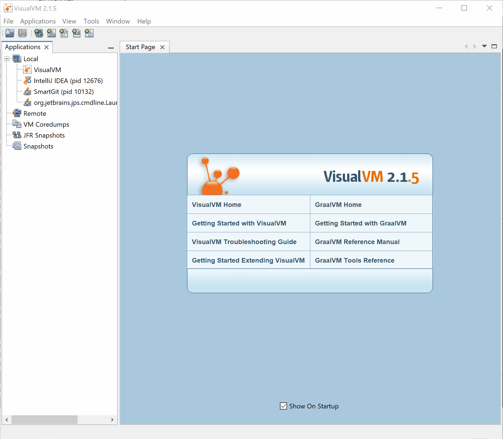

# Inspecting SmartGit's process using VisualVM

*VisualVM* is a free Java Profiler.
This document is written for running VisualVM on Windows.
For Linux and macOS, paths have to be adjusted accordingly.

-   Download *JDK 17 (LTS)*, e.g. from [azul.com](https://www.azul.com/downloads/?package=jdk) (unless you already have a JDK 17 installed) and uncompress to e.g. `C:\jdk`.

	#### Warning
	> Be sure to select the correct platform, architecture (x86/x64 for Windows) and bundle: *.zip* for Windows, *.tar.gz* for Linux and *.deb* for macOS.

-   Download VisualVM from [visualvm.github.io](https://visualvm.github.io/download.html) and uncompress to e.g. `C:\visualvm`

-   Configure SmartGit to collect performance data (required since version 23.1):
    -  open bin/smartgit.vmoptions and append:
    ```
    -XX:+UsePerfData
    ```

-   Run VisualVM:
    -  open a terminal
    -  `cd` to `C:\visualvm\bin`
    -  start `visualvm --jdkhome C:\jdk`

-   Once VisualVM has started up, locate the *SmartGit*-related VMs: there will be one *main* VM, if SmartGit is running (on Windows showing up as `SmartGit`, on Mac/Linux showing up as `QBootLoader`).
    If a SmartGit upgrade is in progress, there will be an additional VM (on Windows showing up as `SmartGitUpdater`).
    If SSH connections are currently in progress, there may be more VMs.

#### Note
> If you can't connect to *SmartGitUpdater* VM, try again running VisualVM as administrator, because SmartGitUpdater is usually invoked with administrative privileges, too.

#### Taking thread dumps

Thread dumps are useful to investigate hangs or slow performance.

-   Select the VM you want to inspect.
-   Select tab **Threads** and invoke **Thread Dump**.
-   When investigating a problem, it's usually a good idea to create a couple of thread dumps.

#### Taking a heap snapshot

Heap snapshots are useful to investigate memory-related problems and do not contain any sensitive information.

-   Select the VM you want to inspect.

-   Select tab **Sampler**, click **Memory** and then **Snapshot**.

-   Right-click the snapshot, save it using **Save As**, then send it to us.



#### Taking a heap dump

Heap dumps are useful to investigate memory-related problems.

-   Select the VM you want to inspect.

-   Select tab **Monitor** and invoke **Heap Dump**.

-   To investigate the current state yourself, the **Classes** section will give you a good overview of the memory usage: sorting by **Instances** and **Size** can be helpful to detect (unusually) large occurrences of specific classes.
    By double-clicking a certain class, you will switch to the **Instances** view which gives you detailed information for every object of this class.

-   To take a full heap dump for debug purposes, select the **Monitor** section and hit the **Heap Dump** button there.

#### Note
> For heap dumps, it's expected to see a lot of `char[]`, `byte[]` and `String` objects, as version control is more or less all about bytes and texts (paths, file contents, commit messages).

Heap dumps are usually huge, so first thing to do is to store them locally using **Save As** from the context menu in the **Applications** view.
This way they can be accessed later on and if necessary can be transferred to us.
