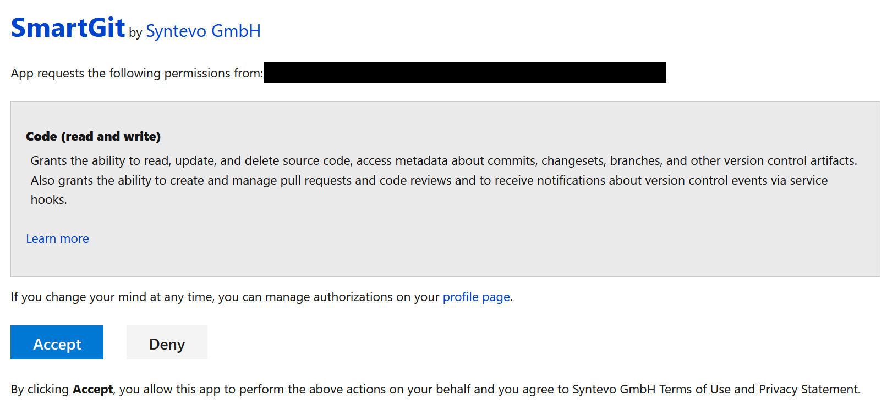
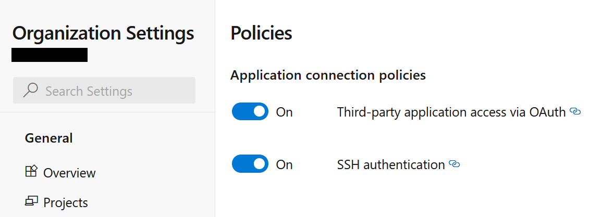
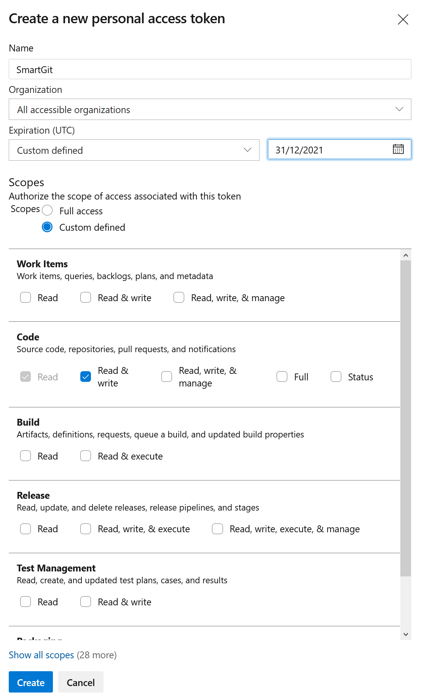

# Azure DevOps

SmartGit integrates Azure DevOps workflows in various places, very
similar to the
[GitHub](GitHub-integration.md)
integration. Some behavior can be customized by [system properties](System-Properties.md#SystemProperties-properties.bitbucket).

### Setup

To set up the Azure DevOps integration, go to **Preferences**, section
**Hosting Providers** and use **Add** there. In the **Add Hosting
Provider** dialog, have **Azure DevOps** selected and invoke **Generate
API token**. This should open up your default web browser where you will
have to confirm by **Accept**.

Once you have confirmed this page, you will be redirected to
*syntevo.com*, where the generated access code will be displayed.
Copy&paste this code into SmartGit's **Generate API Token** dialog and
invoke **Authenticate**. The code will be used to create an *application
access token* which will be used to populate the **Token** field.
Finally, confirm the **Add Hosting Provider** dialog using **Add**.

#### Note
> If above procedure fails make sure to allow **Third-party application
> access via OAuth** in your Organization Settings.
> 
> 

### Setup with Multiple Accounts

If you have multiple Azure DevOps accounts, you can run through the
above procedure for each of your accounts. This requires to login for
every account in your web browser before invoking **Generate API
Token**.

### Alternative setup using a personal access token

If OAuth is no feasible option for you, the Azure DevOps integration can
alternatively be set up using a personal access token ("PAT"). Personal
access tokens can be generated in the Settings area of the Azure web
interface. For PATs to be usable by SmartGit, it's important that
Organization access is set to **All accessible organizations** (even if
you just have a single organization). The scopes can be limited to
**Code** - **Read&Write**.

### Repository access using "Generate Git Credentials"

If you are just interested in accessing your Azure DevOps Git repositories, but you don't need the additional *Azure DevOps Hosting Provider functionality* (like managing pull requests in SmartGit), you may open the Azure website, navigate to your Azure DevOps repository, invoke **Clone** and then **Generate Git Credentials**. When SmartGit asks you for **User Name** and **Password** enter these credentials.
